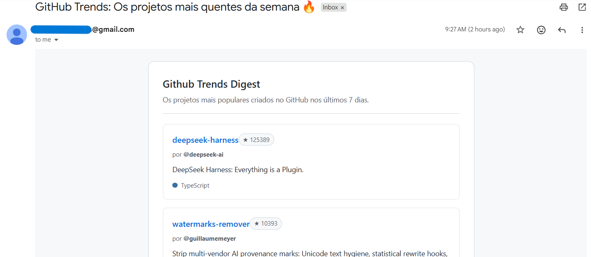

# 🔥 GitHub Trends Bot

Um bot em Python que roda automaticamente **todo domingo** e envia por e-mail os repositórios mais populares criados no GitHub na última semana. Projeto criado para estudar integração com APIs, envio de e-mails e automação com CI/CD.



O envio é 100% automatizado via **GitHub Actions** — não precisando de servidor ou computador ligado.

## O que ele faz

1. Busca no GitHub os repositórios mais estrelados criados nos últimos 7 dias
2. Monta um e-mail em HTML com nome, autor, descrição, estrelas e linguagem de cada projeto
3. Envia o e-mail automaticamente via SMTP (Gmail)
4. Roda sozinho toda semana graças a um agendamento (`cron`) no GitHub Actions

## Por que este bot? (Diferencial em relação ao Trending oficial)

O diferencial deste bot em relação ao Trending tradicional é o seu foco na **descoberta de novos projetos**: ele identifica iniciativas lançadas há poucos dias que já estão ganhando visibilidade na comunidade.

- **Projetos inéditos:** O filtro consulta a API do GitHub buscando exclusivamente repositórios **criados nos últimos 7 dias** (`created:>YYYY-MM-DD`).
- **Descoberta precoce:** Identifica projetos no início do seu lançamento, antes de se tornarem populares.
- **Modelo Push:** Entrega um resumo direto na caixa de e-mail todo domingo, dispensando a necessidade de acessar o site manualmente.

## Tecnologias usadas

- **Python 3.11**
- [`requests`](https://pypi.org/project/requests/) — consumo da API do GitHub
- `smtplib` / `email` — envio de e-mail
- **GitHub Actions** — agendamento e execução automática (CI/CD)
- `python-dotenv` — variáveis de ambiente em desenvolvimento local

## Estrutura do projeto

```
├── main.py              # Orquestra a busca e o envio do e-mail
├── github_api.py         # Busca os repositórios em alta na API do GitHub
├── email_sender.py       # Monta o HTML e envia o e-mail
├── requirements.txt      # Dependências do projeto
└── .github/workflows/
    └── weekly.yml         # Agendamento automático (todo domingo, 9h BRT)
```

## Como rodar localmente

### 1. Clone o repositório

```bash
git clone https://github.com/Anna1lv/github-trends-bot
cd github-trends-bot
```

### 2. Crie um ambiente virtual e instale as dependências

```bash
python -m venv venv
source venv/bin/activate   # No Windows: venv\Scripts\activate
pip install -r requirements.txt
```

### 3. Configure suas credenciais

Crie um arquivo `.env` na raiz do projeto (ele já está no `.gitignore`, então nunca vai parar no repositório):

```env
EMAIL_REMETENTE=seuemail@gmail.com
SENHA_APP=sua_senha_de_app_do_gmail
EMAIL_DESTINATARIO=email_que_vai_receber@gmail.com
```

>**Senha de app do Gmail**: não é a senha normal da sua conta. Você precisa gerar uma "Senha de app" em [myaccount.google.com/apppasswords](https://myaccount.google.com/apppasswords) (exige verificação em duas etapas ativada na conta).

### 4. Rode o bot

```bash
python main.py
```

Se tudo estiver certo, você recebe o e-mail em segundos.

## Automação (GitHub Actions)

O bot roda sozinho toda semana graças ao workflow em `.github/workflows/weekly.yml`, agendado para domingo às 12h UTC (9h no horário de Brasília).

Para funcionar no seu fork, configure os secrets no seu repositório em **Settings → Secrets and variables → Actions**:

| Secret | Descrição |
|---|---|
| `EMAIL_REMETENTE` | E-mail que envia (Gmail) |
| `SENHA_APP` | Senha de app gerada no Gmail |
| `EMAIL_DESTINATARIO` | E-mail que vai receber o resumo |

Você também pode disparar manualmente a qualquer momento pela aba **Actions** do repositório, clicando em "Run workflow" — sem precisar esperar domingo.

## Licença

Este projeto é livre para uso e estudo :D
